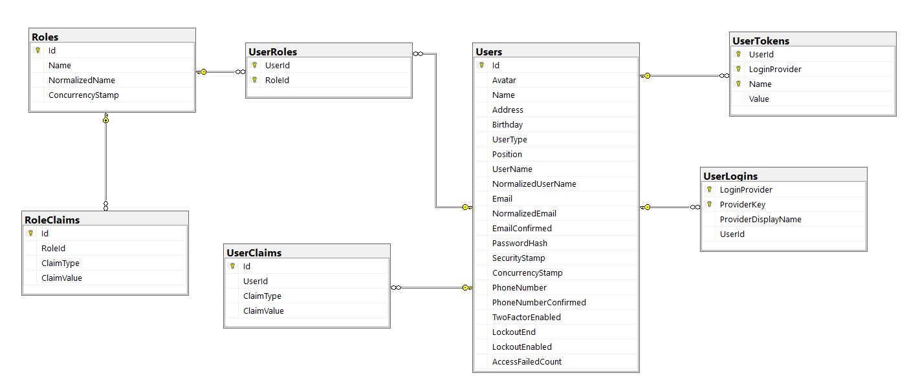
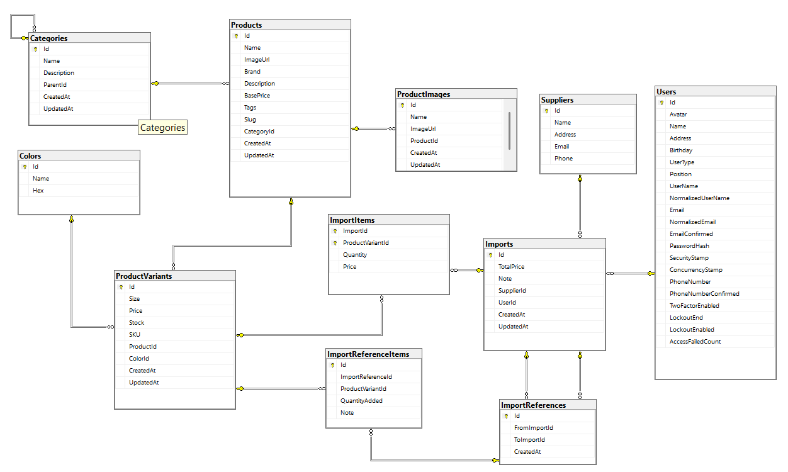
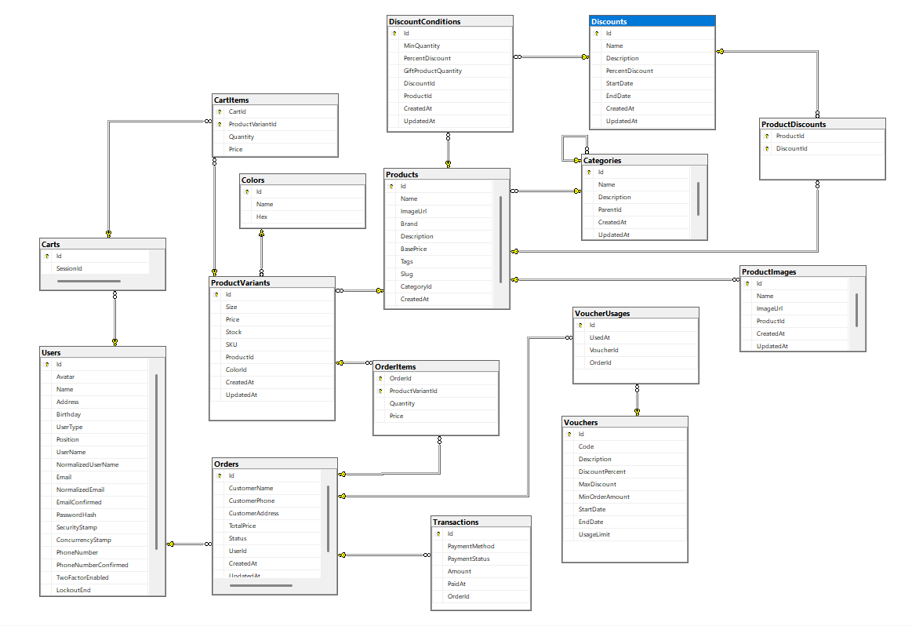


# 👟 SoleKingECommerce — Shoe Store Web Application

## 📌 Overview

**SoleKingECommerce** is a modern e-commerce web application for selling shoes, built using **ASP.NET Core MVC (.NET 8)**. It supports full user authentication and role-based access, product and inventory management, shopping cart, order processing, discounts, and **VNPAY** payment integration.

## 🔧 Technology Stack

- ASP.NET Core MVC (.NET 8)
- Entity Framework Core
- SQL Server
- jQuery
- Bootstrap
- SweetAlert (Swal)
- VNPAY payment gateway
- Redis (for caching)

## 🗂️ Project Structure

```
SoleKingECommerce/
│
├── wwwroot/                   # Static assets (CSS, JS, images)
├── Configurations/            # Configuration classes (e.g. MailSettings)
├── Controllers/               # MVC Controllers
├── Data/                      # ApplicationDbContext, Seeder, DB init
├── Dtos/                      # Data Transfer Objects for APIs/forms
├── Helpers/                   # Utility or helper functions/classes
├── Migrations/                # EF Core migrations
├── Models/                    # Entity classes (EF models)
├── Repositories/             # Repository interfaces and implementations
├── Services/                 # Business logic services
├── ViewComponents/           # Custom ViewComponents used to render reusable partial views with logic
├── ViewModels/               # View-specific models for Razor pages
├── Views/                    # Razor views (.cshtml)
├── appsettings.json          # App configuration
├── appsettings.Development.json
└── Program.cs                # App entry point and service config
```

## 🧩 Database Schema

The SQL Server database is divided into 3 main domains:

### 1. 🔐 Identity & Access Control

| Table         | Description                                                  |
|---------------|--------------------------------------------------------------|
| `Users`       | Extended user profile info (avatar, name, roles...)          |
| `Roles`       | Role definitions (Admin, Staff, Customer...)                 |
| `UserRoles`   | User-role mapping                                            |
| `UserClaims`  | Custom claims for users                                      |
| `RoleClaims`  | Claims associated with roles                                 |
| `UserLogins`  | External login support                                       |
| `UserTokens`  | Token data for auth flows                                    |

### 2. 📦 Product & Inventory Management

| Table                  | Description                                                  |
|------------------------|--------------------------------------------------------------|
| `Categories`           | Shoe categories with nested structure                        |
| `Products`             | Basic shoe product data                                      |
| `ProductVariants`      | Variants based on size, color, SKU, stock                    |
| `Colors`               | Color name and hex code                                      |
| `ProductImages`        | Multiple images per product                                  |
| `Suppliers`            | Supplier contact information                                 |
| `Imports`              | Stock import records                                         |
| `ImportItems`          | Imported variant details                                     |
| `ImportReferences`     | Transfer references between imports                          |
| `ImportReferenceItems`| Transferred variant data                                     |

### 3. 🛒 Cart, Orders & Promotions

| Table              | Description                                                             |
|--------------------|-------------------------------------------------------------------------|
| `Carts`            | Session/user-bound cart                                                 |
| `CartItems`        | Items inside the cart                                                   |
| `Orders`           | Customer orders with contact info and status                            |
| `OrderItems`       | Line items of an order                                                  |
| `Transactions`     | Payment transaction info                                                |
| `Vouchers`         | Discount codes with limits and conditions                               |
| `VoucherUsages`    | Logs voucher usage per order                                            |
| `Discounts`        | Discount campaigns                                                      |
| `DiscountConditions`| Conditions for applying discounts                                       |
| `ProductDiscounts` | Linking discounts to specific products                                  |

## 💳 VNPAY Integration

The app integrates **VNPAY** for online payments:

- Users are redirected to the VNPAY gateway at checkout.
- Key parameters (`Amount`, `OrderInfo`, `TmnCode`, `ReturnUrl`, etc.) are generated and signed using `HashSecret`.
- After payment, users are redirected back, and the transaction is verified server-side.

## ✨ Key Features

- 🔐 Role-based access: Admin, Client
- 👟 Shoe product management with size/color variants
- 📦 Inventory control and import tracking
- 🛒 Shopping cart and order flow
- 🎟️ Discount vouchers and promotional rules
- 💳 Online payment with VNPAY
- 📬 Email sending via configuration
- 🔔 User-friendly UI with SweetAlert notifications

## 📷 ER Diagrams

Entity-Relationship diagrams are available for:

- Identity and user management  

- Product and inventory tracking  

- Cart, order, and discount systems  


## 📫 Contact

- **Author**: Thinh Huynh
- **Email**: trthinh2003@gmail.com
- **GitHub**: [github.com/trthinh2003](https://github.com/trthinh2003)  